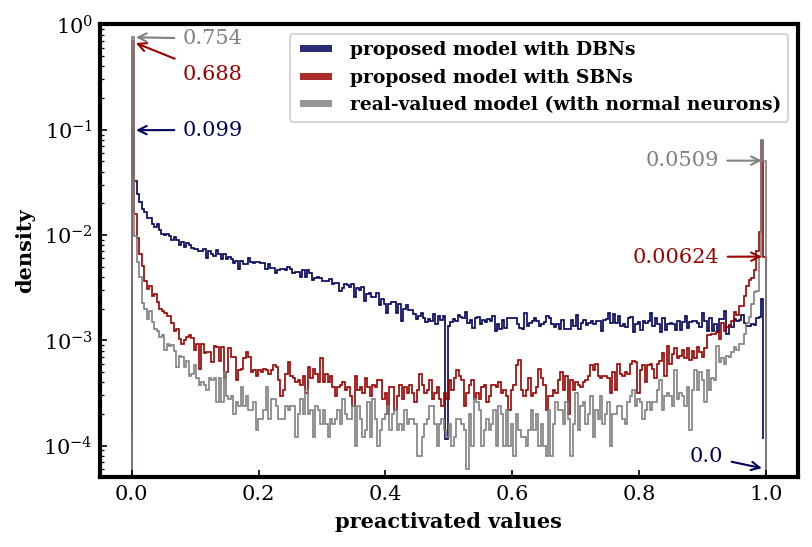

# Results

## Experiment I &mdash; Comparison of the proposed model using deterministic binary neurons and stochastic binary neurons

We compare the performance of using deterministic binary neurons (DBNs)
and stochastic binary neurons (SBNs) in the proposed model.

| proposed model with DBNs | proposed model with SBNs |
|:------------------------:|:------------------------:|
|  |  |

The following figures show the preactivated outputs (i.e., the real-valued,
intermediate values right before the binarization operation).

| proposed model with DBNs | proposed model with SBNs |
|:------------------------:|:------------------------:|
|  |  |

In order to see how DBNs and SBNs work differently, we compute the histograms of
their preactivated outputs.

We can see that

- DBNs tend to output more preactivated values in the middle of zero and one and
  avoid producing preactivated values around the decision boundary (i.e. the
  threshold, 0.5 here)
- SBNs tend to output more preactivated values close to zero and one

## Experiment II &mdash; Comparison of the proposed model and the real-valued model

We compare the proposed model with a variant that uses normal neurons at the
output layer (with sigmoid functions as the activation functions). We refer t
this model as the _real-valued model_.

| raw prediction | hard thresholding | Bernoulli sampling |
|:--------------:|:-----------------:|:------------------:|
|  |  |  |

We also show the histogram of its probabilistic predictions in the figure above.
We can see that

- the histogram of the real-valued model is more U-shaped than that of the
  proposed model with SBNs
- there is no notch in the middle of the curve as compared to the proposed model
  with DBNs.

From here we can see how different binarization strategies can shape the
characteristics of the preactivated outputs of binary neurons. This also
emphasizes the importance of including the binarization operations in the
training so that the binarization operations themselves can also be optimized.

## Experiment III &mdash; Comparison of the proposed model trained with the GAN, WGAN and WGAN-GP objectives

We compare the proposed model trained by the WGAN-GP objective with that trained
by the GAN objective and by the WGAN objective.

| GAN model with DBNs | GAN model with SBNs |
|:-------------------:|:-------------------:|
|  |  |

| WGAN model with DBNs | WGAN model with SBNs |
|:--------------------:|:--------------------:|
|  |  |

We can see that the WGAN model is able to generate digits with similar qualities
as the WGAN-GP model does, while the GAN model suffers from the so-called mode
collapse issue.

## Experiment IV &mdash; Comparison of the proposed model using multilayer perceptrons and convolutional neural networks

We compare the performance of using multilayer perceptrons (MLPs) and
convolutional neural networks (CNNs). Note that the number of trainable
parameters for the MLP and CNN models are 0.53M and 1.4M, respectively.

| CNN model with DBNs | CNN model with SBNs |
|:-------------------:|:-------------------:|
|  |  |

We can see that the CNN model can better capture the characteristics of
different digits and generate less artifacts even with a smaller number of
trainable parameters as compared to the MLP model.
